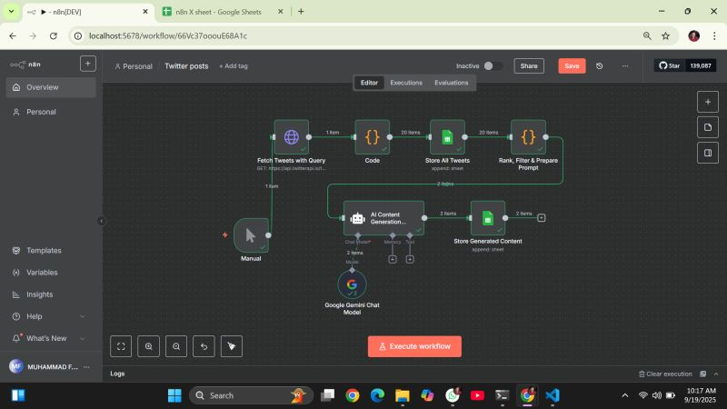

# Twitter Auto-Post Automation (n8n Workflow)

This repository contains an n8n workflow that **fetches tweets from competitors**, analyzes the content, extracts context, and then **generates original AI-powered tweets** using a Large Language Model (LLM).  
The workflow is fully automated and optimized for social media growth.

---

## 📌 What This Workflow Does

### 🔹 1. Fetch Competitor Tweets
Pulls recent tweets from a specific competitor or keyword-based search.

### 🔹 2. Analyze and Understand Context
Uses custom code + ranking to:
- Filter irrelevant tweets  
- Classify content  
- Extract intent (motivation, information, trend, opinion, etc.)

### 🔹 3. AI Tweet Generation
Based on extracted patterns, the workflow:
- Generates multiple high-quality tweets using Google Gemini / OpenAI  
- Ensures uniqueness (avoids copy/paste or plagiarism)  
- Matches your brand tone  

### 🔹 4. Store or Auto-Post Tweets
Tweets can be:
- Saved to a sheet / database  
- Automatically posted to Twitter (if connected)

---

## 🖼 Workflow Screenshot

---

## 🧩 Node Breakdown

### **1. Fetch Tweets with Query**
Fetches competitor tweets using:
- Twitter API  
- A search string (e.g., "AI trends", "competitor username")

### **2. Code (Filter & Prepare Data)**
Processes the fetched content:
- Rank tweets  
- Remove irrelevant items  
- Clean / normalize text  

### **3. Store All Tweets**
Saves pre-processed tweets for logging or reuse.

### **4. Rank, Filter & Prepare Prompt**
Creates a prompt such as:
> "Generate 5 unique tweets inspired by these competitor tweets while avoiding duplication."

### **5. AI Content Generation (Gemini / GPT)**
Uses an LLM to produce:
- Trending  
- Professional  
- High-engagement tweets  

### **6. Store Generated Content**
Saves AI-generated tweets to a Google Sheet / DB.

---

## 🚀 How To Use

1. Import `workflow.json` into n8n.  
2. Add Twitter API (v2) credentials.  
3. Add Gemini / OpenAI API credentials.  
4. Configure:
   - Search query  
   - Competitor handle  
   - Number of tweets to fetch  
5. Click **Execute Workflow** or set a **Cron Trigger** for automation.

---

## 📁 Repository Structure

