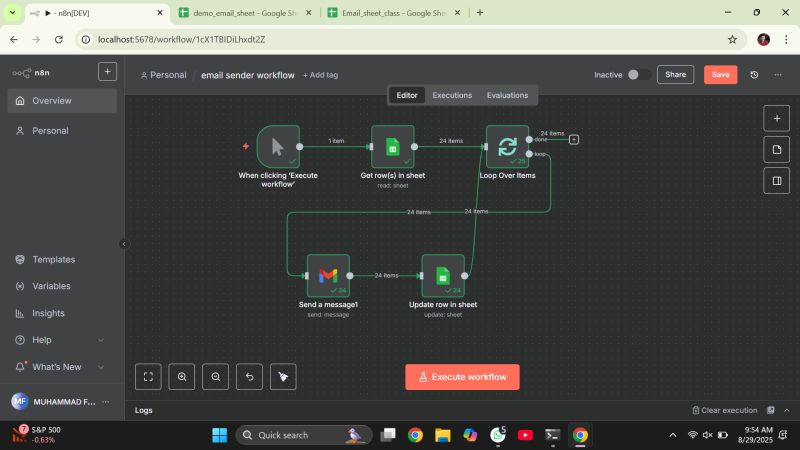

# Email Sender Workflow

This n8n workflow reads data from a Google Sheet, sends an email for each row, and updates the sheet after sending. It is useful for sending bulk emails, automated notifications, or any workflow that processes spreadsheet data.

---

## 📌 Workflow Screenshot
_Add your screenshot below (replace this line with the image)._

---

## 🚀 What This Workflow Does

1. **Trigger** – Workflow starts when executed manually.
2. **Google Sheets (Read Rows)** – Fetches rows from a spreadsheet.
3. **Loop Over Items** – Processes each row one by one.
4. **Gmail / Email Node** – Sends an email using values from the sheet.
5. **Google Sheets (Update Row)** – Updates the row to mark email as sent.

---

## 🧩 Required Setup

### 1. Google Sheets Connection
- Make sure you have added your Google Sheets credentials in n8n.
- Replace the Spreadsheet ID & Sheet Name in the Read node.

### 2. Email Credentials
Use one of the following:
- Gmail OAuth2
- SMTP (Gmail, Outlook, etc.)

### 3. Update Node Settings
Make sure the **row index** and **status column** match your sheet.

---

## 📁 Files Included

- `workflow.json` — The exported n8n workflow.
- `workflow.png` — Screenshot of the workflow (you will add this).

---

## ▶️ How to Use

1. Import `workflow.json` into n8n.
2. Configure your:
   - Google Sheets credentials
   - Email credentials
3. Run the workflow once using **Execute Workflow**.
4. Check your Google Sheet to confirm updates.

---

## 🛠 Troubleshooting

- **Error reading sheet** → Check Spreadsheet ID and permissions.
- **Email not sending** → Verify email credentials and API access.
- **Row not updating** → Ensure correct Row ID mapping.
- **Loop not running** → Check if the sheet has data.

---

## 📄 License
You may use or modify this workflow freely for personal or commercial projects.

