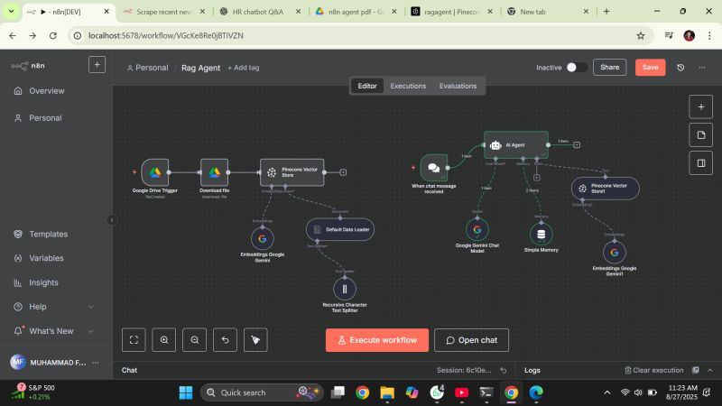
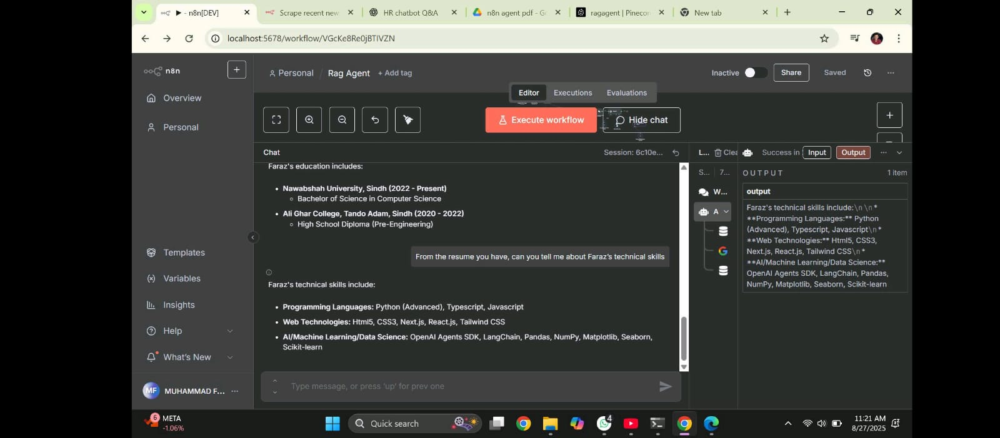

# RAG Agent Chatbot (n8n Workflow)

This repository contains an n8n workflow that implements a full **Retrieval-Augmented Generation (RAG) chatbot**.  
The system works in two phases:

1. **Data Ingestion Phase** – Load and embed documents, then store them in Pinecone for semantic retrieval.
2. **Chatbot Phase** – Retrieve relevant chunks from Pinecone and generate intelligent answers using an LLM.

This workflow is useful for:
- Resume-based Q&A chatbots  
- Document-based assistants  
- PDF / Drive knowledge chatbots  
- Context-aware HR or customer support bots  

---

## 📌 Workflow Screenshots

### 🔹 1. Workflow Overview  

---

### 🔹 2. Chat Example – Q&A About Projects  

---

## 🧠 Workflow Architecture

### 🔷 Phase 1 — Data Ingestion & Vector Store Creation  
This phase triggers when a file is uploaded to Google Drive.

**Nodes Included:**
- Google Drive Trigger  
- Download File  
- Text Loader / PDF Loader  
- Embeddings (Google Gemini / OpenAI)  
- Pinecone Vector Store (Upsert)  

**Purpose:**  
To convert document text into embeddings and store them in Pinecone so that the chatbot can retrieve relevant information later.

---

### 🔷 Phase 2 — RAG Chatbot Agent  
This phase handles user queries.

**Nodes Included:**
- Chat Trigger (`When chat message received`)  
- Embeddings for query  
- Pinecone Vector Search  
- LLM Agent (Gemini / OpenAI)  
- Simplex Memory (Conversation memory)  

**Purpose:**  
To retrieve context from Pinecone and generate accurate, context-aware responses.

---

## 🚀 How It Works

### 1️⃣ File Upload → Vector Store  
- User uploads a PDF or document.  
- Workflow downloads and processes the file.  
- The document is split into chunks.  
- Embeddings are generated for each chunk.  
- Chunks + embeddings are stored in Pinecone.

### 2️⃣ Ask a Question → Intelligent Response  
- The user types a question into the chat UI.  
- The question is embedded.  
- Pinecone returns top relevant chunks.  
- LLM generates a final answer using retrieved context.

---

## 🧩 Requirements

### Accounts / Services Needed
- **n8n**
- **Google Drive API**
- **Pinecone Vector DB**
- **Embedding Provider:** Google Gemini / OpenAI
- **LLM Provider:** Gemini / OpenAI

### n8n Credentials
- Google Drive OAuth  
- Pinecone API Key  
- Gemini / OpenAI API Key  

---

## 📁 Repository Contents

